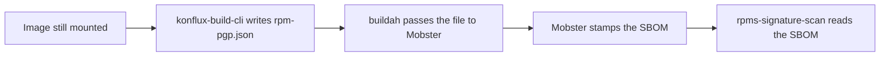

# 72. Scan RPM signatures from the image SBOM

Date: 2026-10-08

## Status

Proposed

## Context

`rpms-signature-scan` exists so a Konflux build can fail when the **shipped image** contains unsigned RPMs. Today it uses the installed rpmdb (`rpm -qa`) as the inventory, not Syft's package list. This ADR keeps that inventory: stamps come from `rpm -qa` at build time. No database means nothing installed to judge, so today's scan passes with unsigned 0.

Today the task does that by **pulling the image built by the build task**, unpacking the layers, and querying the rpmdb again. That is a second full materialization of the image, after the build already had the filesystem mounted for Syft. Cost grows with image size and with every architecture in a matrix: CPU, memory, disk, and wall time. [ADR 0070](0070-dual-compression-for-container-builds.md) already notes that this extractor also breaks on zstd:chunked layers.

The query itself is cheap if it runs while the image is still mounted. The expensive part is doing it later from a pushed image.

## Decision

Capture RPM PGP key IDs at **build time**, record them in the **attached SBOM**, and change `rpms-signature-scan` so it **only reads that SBOM**.

Pass and fail stay as they are today: unsigned installed RPMs fail the scan, a fully signed rpmdb passes, and no rpmdb passes with unsigned 0. The build step that writes the data is best-effort (it must not fail `image build`). The scan stays strict: missing or failed stamps are a fail.

Mobster writes the stamps onto RPM packages in the **merged** SBOM it emits ([ADR 0044](0044-spdx-support.md) jsonencoded annotations / CycloneDX component properties), after Hermeto and Syft are combined. Join `rpm -qa` to `pkg:rpm` rows in that document. The installed rpmdb is the inventory, not Hermeto's prefetch list. A Hermeto RPM that is not installed gets no stamp and is not unsigned. Hermeto detecting signatures at prefetch is out of scope.

SPDX 2.3 and CycloneDX 1.5 have no field for an RPM header PGP key ID. Checksums are content hashes, not the signer. Record the data as Konflux properties ([ADR 0044](0044-spdx-support.md)): `rpm:pgp-key-id` on each matching package (hex key ID or `unsigned`); `rpm:pgp-key-id=no-rpmdb` on the image package when there is no database; `rpm:pgp-stamp-reason` on the image package when the query failed or stamps are missing.

### Paths

Not every image takes the same path. The builder looks at the Syft SBOM first, then (only if needed) at the image rpmdb. Mobster copies that outcome into the attached SBOM. The scan reads only the SBOM.

- If Syft listed RPM packages (`pkg:rpm`), run `rpm -qa` and stamp each matching package. If `rpm -qa` has RPMs with no matching `pkg:rpm`, write a **reason on the image package** and the scan **fails**.
- If Syft listed **no** RPM packages, still probe the rpmdb. No database (or empty) is `no_rpmdb`: the scan **passes**. If the database has RPMs, the cataloger was off (Mobster has nothing to join): write a **reason on the image package** and the scan **fails**.

| Path | Builder writes | Scan result |
|---|---|---|
| Syft has RPMs, image has an rpmdb | key ID (or `unsigned`) on each matching package | same as today's `rpm -qa` |
| `rpm -qa` has RPMs with no matching `pkg:rpm` | reason on the image package | **fail** |
| Hermeto listed extra RPMs not in the rpmdb | no stamp on those packages | ignore; not unsigned |
| Syft has no RPMs, no rpmdb (or empty) | `no_rpmdb` on the image package | **pass**, unsigned 0 |
| Syft has no RPMs, rpmdb has RPMs (cataloger off) | skip package stamps; reason on the image package | **fail** |
| `rpm` missing or `rpm -qa` failed | reason on the image package | **fail** with that reason |
| Builder never wrote stamps | nothing | **fail** |

### Work order

This is the order to land the code, so each step has what it needs. It is not the order of steps inside one pipeline run (that is the diagram below). Until the last step ships, `rpms-signature-scan` keeps extracting the image.

1. **konflux-build-cli** — write `rpm-pgp.json` while the image is still mounted (probe the rpmdb even when Syft has no `pkg:rpm`, so no-rpmdb still passes).
2. **Mobster** — accept that file on `generate oci-image` and stamp the merged SBOM.
3. **buildah** (container-build-catalog) — pass the file in `mobster_args` (for example `--rpm-pgp-path /shared/rpm-pgp.json`).
4. **tools image** — `rpm_verifier` reads the attached SBOM and no longer extracts the image.
5. **Bump `rpms-signature-scan`** so pipelines use that tools image ([ADR 0054](0054-task-versioning.md)).

## Alternatives Considered

**Keep extracting the image.** No change to accuracy, but the resource cost and zstd breakage remain.

**Trusted Artifact or a sibling OCI artifact, skip the SBOM.** A Trusted Artifact is pipeline plumbing; every pipeline that runs the scan would need the URI. Attaching the JSON to the image with `oras attach` would let the scan find it from the digest it already has, with no new param. That is still a second artifact. EC and release already fetch the companion SBOM and would not see this file unless they grew a new fetch. Stamps on the SBOM reuse that document.

**Have konflux-build-cli edit the Syft SBOM itself.** Faster to try, but Mobster owns merge and contextualization. Stamps belong in that step so they survive the document Mobster emits.

## Consequences

The scan becomes a small SBOM read instead of an image pull. Build pipelines spend less time and memory, especially on large and multi-arch images. RPM signature data lives on the attached SBOM with the rest of the component inventory.
